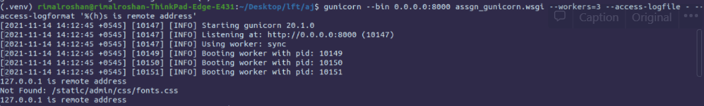

### Step 1: Create a virtual environment, activate it and install

```bash
mkdir assgn-gunicorn
cd assgn-gunircorn
virtualenv .venv
source .venv/bin/activate
pip install django gunicorn
```

### Step 2: Create Django Starter Project

```bash
django-admin.py startproject assgn_gunicorn .
```

### Step 3: (Optional) Edit the [settings.py](http://settings.py) to and change ALLOWED_HOST

```bash
nano assgn_gunicorn/settings.py
```

Replace `ALLOWED_HOSTS =` ['localhost']

### Step 4: Deploy 3 instance of the application using gunicorn

### 4. 2  Set the access log file and log output format to be nondefault format\

### 4. 3  Set the error log file

```bash
	gunicorn --bind 0.0.0.0:8000 assgn_gunicorn.wsgi --workers=3 \
					 --access-logfile gunicorn_logs \
					 --access-logformat 'requested from remote address %(h)s' \
					 --error-logfile gunicorn_error
```

### Relevant Screenshots/Outputs:

To prove logging in custom format form the gunicorn server

